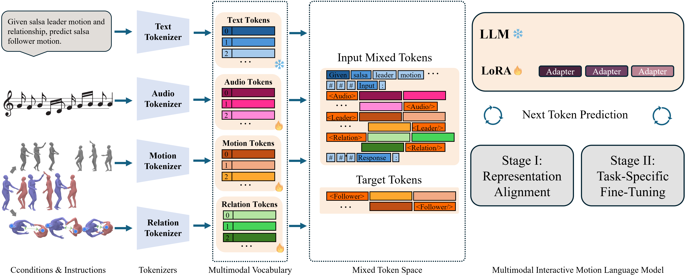

# SalsaAgent: A Multimodal Embodied Language Model for Interactive Dance Generation

**Payam Jome Yazdian**, **Zoe Stanley**, **Angelica Lim**  
Simon Fraser University

[Paper](https://arxiv.org/abs/2605.29219) | [Project Page](https://pjyazdian.github.io/Salsa-Agent/) | [Video](https://pjyazdian.github.io/Salsa-Agent/#video) | [Gallery](https://pjyazdian.github.io/Salsa-Agent/#gallery)

<p align="center">
  
</p>

SalsaAgent generates expressive, full-body **follower** salsa motion in reaction to an observed **leader** and background **music**. We formulate partner dance as nonverbal motion token passing: discrete motion tokens, pairwise relation tokens, and audio are fused in a fine-tuned large language model, then refined with a diffusion stage in shared interaction space. Evaluated on [CoMPAS3D](https://huggingface.co/datasets/Rosie-Lab/compas3d), SalsaAgent improves partner coordination, follower motion quality, and beat synchrony over Duolando and InterGen in both objective metrics and a human preference study.

---

## Overview

Social salsa follows a lead–follow dynamic: the leader gives nonverbal cues and the follower responds while both stay aligned to the music. SalsaAgent targets this **leader-to-follower** generation task—given audio and observed leader motion, predict coordinated follower motion.

The pipeline has three parts:

1. **VQ-VAE tokenizers** — separate codebooks for canonicalized full-body motion and pairwise leader–follower relation trajectories (20-frame windows).
2. **Multimodal LLM** — Gemma2 with an extended vocabulary for motion, relation, and audio tokens; two-stage training with LoRA and MotionScript text grounding for token alignment.
3. **Diffusion refinement** — a conditional denoiser in shared world-frame joint space to improve partner geometry, timing, and contact detail while preserving LLM-level semantics.

For qualitative results, baselines, and the full test-set gallery, see the [project page](https://pjyazdian.github.io/Salsa-Agent/).

---

## Getting Started

From the repository root:

```bash
conda create -n SalsaAgent python=3.10
conda activate SalsaAgent
pip install -r requirements.txt
```

Additional packages used by parts of the pipeline include `lmdb`, `human_body_prior`, `roma`, and `body_visualizer`. See [Pretrained Models & Assets](#pretrained-models--assets) for checkpoints and body models.

---

## Pretrained Models & Assets

### Pretrained checkpoints (Google Drive)

SalsaAgent and related pretrained weights are available here:

**[Download checkpoints](https://drive.google.com/drive/folders/19lg8eX9N8_y_Nfz0L5i3utvEb47Kt3G1?usp=sharing)**

Place downloaded files under `./checkpoints` (or your chosen path) for demo and evaluation.

### Additional download scripts

```bash
bash prepare/download_ckpt.sh       # Motion-Agent base checkpoints
bash prepare/download_glove.sh      # GloVe embeddings
bash prepare/download_extractor.sh  # Evaluation extractor models
```

Motion and relation VQ-VAE tokenizers can be trained with the commands in [motion_representation/README.md](motion_representation/README.md), or use checkpoints from the download scripts when available.

### WavTokenizer (audio tokens)

The demo uses WavTokenizer for audio at 40 tokens/sec. Download the checkpoint:

```bash
mkdir -p utils/salsa_utils/libs/WavTokenizer/results/train
python -c "from huggingface_hub import hf_hub_download; hf_hub_download(repo_id='novateur/WavTokenizer-large-unify-40token', filename='wavtokenizer_large_unify_600_24k.ckpt', local_dir='utils/salsa_utils/libs/WavTokenizer/results/train')"
```

Install WavTokenizer dependencies and add to `PYTHONPATH`:

```bash
cd utils/salsa_utils/libs/WavTokenizer && pip install -r requirements.txt
export PYTHONPATH="$PYTHONPATH:$(pwd)/utils/salsa_utils/libs/WavTokenizer"
```

Source: [Hugging Face — WavTokenizer-large-unify-40token](https://huggingface.co/novateur/WavTokenizer-large-unify-40token/tree/main)

### Body models & MotionScript

1. **SMPL-X** — download from the [SMPL-X website](https://smpl-x.is.tue.mpg.de/) and place under `./body_model/smplx`.
2. **SMPL-H (AMASS)** — place under `./utils/salsa_utils/libs/MotionScript/data/smplh_amass` for [MotionScript](https://arxiv.org/pdf/2312.12634) text grounding during pretraining.

---

## Data Preparation

SalsaAgent is trained and evaluated on [CoMPAS3D](https://huggingface.co/datasets/Rosie-Lab/compas3d) (72 improvised salsa duet recordings from 9 pairs across three proficiency levels, with synchronized music and frame-level move annotations). Raw data can be obtained from the dataset release; **this repository provides the preprocessing pipelines** that transform those recordings into synchronized, labeled LMDB training data for music-driven two-person salsa dance generation. The pipeline supports both the HumanML3D 263-dimensional motion representation and the InterHuman 262-dimensional motion representation with relationship features for interactive motions.

### Option A: Download processed LMDB

Preprocessed CoMPAS3D LMDB files (`lmdb_train`, `lmdb_test`) are available on Google Drive:

**[Download processed LMDB](https://drive.google.com/drive/folders/1J5GCxg-b3W58g6TipvlHx7emc0AQSLRC?usp=drive_link)**

Extract and place under `./dataset_processed_New/lmdb_Salsa_pair/` so you have:

```
dataset_processed_New/lmdb_Salsa_pair/lmdb_train
dataset_processed_New/lmdb_Salsa_pair/lmdb_test
```

The LMDB contains data required for both HumanML3D and InterHuman representations; the active format is selected at training time via `--motion-repr-type`.

### Option B: Process from raw CoMPAS3D

1. Download raw CoMPAS3D (SMPL-X fits and `synced_animation/` with paired motion and audio).

2. Place an example HumanML3D joint file for skeleton offset computation:
   - Source: `000021.npy` from HumanML3D processed `new_joints`
   - Destination: `body_model/HML3D_Example_joonts/000021.npy`

3. Run preprocessing:

```bash
python utils/salsa_utils/salsa_utils.py \
    --salsa_data_root /path/to/CoMPAS3D \
    --save_path ./dataset_processed_New
```

This creates `./dataset_processed_New/lmdb_Salsa_pair/lmdb_train` and `lmdb_test`.

4. Optional cache for faster loading:

```bash
python demo.py --create_cache_only --split train
```

---

## Training SalsaAgent

Training follows a two-stage strategy similar to [Motion-Agent](https://github.com/szqwu/Motion-Agent): **Stage 1** learns multimodal motion–language alignment; **Stage 2** fine-tunes on leader-to-follower generation.

**Script:** `train_motionllm_salsa.py`

### Stage 1 — multimodal pretraining

InterHuman representation (recommended for the Salsa pipeline):

```bash
python train_motionllm_salsa.py \
    --motion-repr-type interhuman \
    --include-audio \
    --task none \
    --lr 1e-5 \
    --epochs 500 \
    --train-batch-size 4 \
    --save-dir output_trained/stage1_interhuman_audio
```

Key Stage 1 options (see `python train_motionllm_salsa.py --help` for the full list):

- **`--motion-repr-type`** — `humanml3d` (263-dim HumanML3D vectors) or `interhuman` (262-dim InterHuman representation with relationship features; recommended for SalsaAgent).
- **`--include-audio`** — add audio tokens to the LLM vocabulary and train with music conditioning.
- **`--no-MDM`** — use the MotionScript-augmented cache instead of the default MDM cache (enables MotionScript text captions during pretraining).
- **`--use-wandb`** — log to Weights & Biases; pair with `--wandb-project` and `--wandb-run-name` (defaults: `Salsa-Agent`, run name derived from task).

Example with wandb:

```bash
python train_motionllm_salsa.py \
    --motion-repr-type interhuman \
    --include-audio \
    --task none \
    --lr 1e-5 \
    --epochs 500 \
    --train-batch-size 4 \
    --save-every 5 \
    --save-dir output_trained/stage1_interhuman_audio \
    --use-wandb \
    --wandb-project Salsa-Agent \
    --wandb-run-name stage1_interhuman_audio
```

Example with MotionScript cache (non-MDM):

```bash
python train_motionllm_salsa.py \
    --motion-repr-type interhuman \
    --include-audio \
    --no-MDM \
    --task none \
    --lr 1e-5 \
    --epochs 500 \
    --train-batch-size 4 \
    --save-every 5 \
    --save-dir output_trained/stage1_interhuman_motionscript \
    --use-wandb \
    --wandb-project Salsa-Agent \
    --wandb-run-name stage1_interhuman_motionscript
```

### Stage 2 — leader-to-follower fine-tuning

Resume from a Stage 1 checkpoint:

```bash
python train_motionllm_salsa.py \
    --motion-repr-type interhuman \
    --include-audio \
    --task leader_rel_to_follower \
    --resume-ckpt output_trained/stage1_interhuman_audio/Xmotionllm_epoch500.pth \
    --lr 1e-5 \
    --epochs 50 \
    --save-every 10 \
    --save-dir output_trained/leader_rel_to_follower
```

Train motion and relation VQ-VAE tokenizers separately before LLM training — see [motion_representation/README.md](motion_representation/README.md).

---

## Demo & Inference

Place downloaded checkpoints under `./checkpoints` (or your chosen path) and run:

```bash
python demo.py \
    --model_ckpt ./checkpoints/finetune/leader_to_follower.pt \
    --task leader_to_follower
```

The primary evaluated task is **leader-to-follower** generation: given leader motion and music, the model predicts follower motion. Omit `--task` to choose interactively.

---

## Motion Tokenizers

VQ-VAE tokenizers for full-body InterHuman motion and pairwise relationship features live in `motion_representation/`. Training, evaluation, and checkpoint naming are documented in:

**[motion_representation/README.md](motion_representation/README.md)**

Recommended checkpoints:
- HumanML3D: `motion_representation/checkpoints_VQVAE_GRU/`
- InterHuman motion: `motion_representation/checkpoints_VQVAE_GRU_InterHuman/`
- Relationship: `motion_representation/checkpoints_VQVAE_GRU_Relationship/`

---

## Visualization

- **Dataset browser:** `python visualization/visualization_app.py` (web interface)
- **Salsa-Agent interface:** `python visualization/visualization_app_interhuman.py` — InterHuman motions, relationship features, tokens, reconstructions, and the SalsaAgent motion language model interface (LLM inference tab; web interface)
- **Tokenizer / reconstruction app:** [motion_representation/visualization/README.md](motion_representation/visualization/README.md)
- **Batch comparison videos:** `python -m motion_representation.visualize_comparison` (see motion representation README)
- **Project webpage:** [docs/](docs/) — deploy via GitHub Pages for the full [project page](https://pjyazdian.github.io/Salsa-Agent/)

---

## Citation

If you use SalsaAgent or this benchmark, please cite:

```bibtex
@article{yazdian2026salsaagent,
  title={SalsaAgent: A multimodal embodied language model for interactive dance generation},
  author={Jome Yazdian, Payam and Stanley, Zoe and Lim, Angelica},
  year={2026},
  note={Under review}
}
```

---

## Acknowledgements

We thank the authors of:

- [T2M-GPT](https://github.com/Mael-zys/T2M-GPT)
- [Motion-Agent](https://github.com/szqwu/Motion-Agent)
- [MotionGPT / text-to-motion](https://github.com/EricGuo5513/text-to-motion)
- [Duolando](https://github.com/lisiyao21/Duolando) and [InterGen](https://github.com/tr3e/InterGen) (baselines)
- [in2IN](https://github.com/pabloruizponce/in2IN) (InterHuman visualization utilities)
